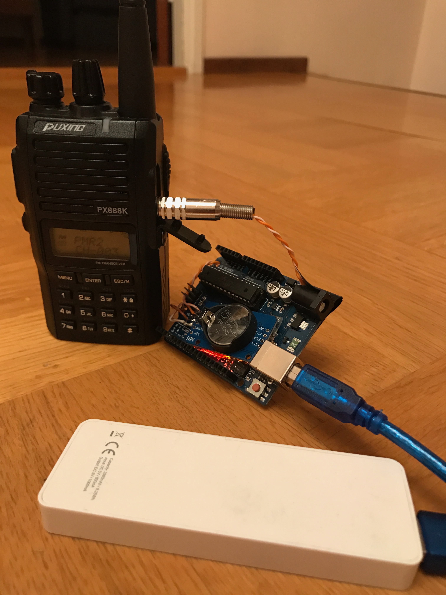

# arduino-say-time
Transmit time every hour using a VHF/UHF radio

## Background
I am often out snowboarding with friends and to communicate we use headsets and UHF radios. This is a really nice way to keep track of each other and also to avoid splitting the group. Besides, when traveling to different countries, mobile phone calling rates may be huge so using radios are very useful. Have a headset with the PTT-button in the glove makes it easy to talk with the group. 

One thing that I am missing is to know what time it is. Althought it is not necessary to know the exact time it is nice to at least have a feeling about the clock.

## Say time
This simple Arduino hack have a RTC clock and using the Talkie library to wake once every hour and say the hour. The Talkie library uses the high speed PWM output and using a low-pass filter this can be connecteced directly into the radio. Enable VOX on the radio and the radio will transmit the hour every hour. 

Simply put the radio and Arduino in your backpack and every hour you'll sync your brain with the current time! The plug is compatble with K-plug (Puxing, Baofeng etc.) and probably other.

